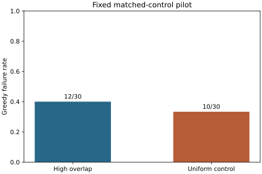

# 高重叠对照：本轮未确认失效率差异

在这次固定参数的配对试验中，Greedy 在高重叠处理组失手 12/30 次，在 uniform
对照组失手 10/30 次，样本失效率差为 6.67 个百分点。双侧精确 McNemar 检验
得到 p=0.7744140625；本轮未获得足够的失效率差异证据。[C1](../experiments/core_rq/CLAIMS.md#c1)

## 怎样比较

使用预先提交的[固定配置](../experiments/core_rq/overlap_pilot_v1/config.json)，
比较共核式 `high_overlap` 与维度、理论期望集合大小匹配的 `uniform`。
每组有 30 个实例，按 repetition 配成 30 对；每个实例有 48 个元素、16 个候选集合，
选择预算为 4。配对共享配置派生的有效 seed，沿用低索引优先的 Greedy 决策规则。
60 个实例均有完成的穷举最优参考，没有删除或替换配对。[C1](../experiments/core_rq/CLAIMS.md#c1)

失手定义为整数覆盖量 `G < O`，其中 `O` 是该实例的穷举最优值；相对 gap 为
`(O-G)/O`。主指标是处理组减对照组的失效率差，预定主检验为双侧精确 McNemar，
alpha=0.05。辅助 gap 均值包含全部零 gap 实例，不另作显著性搜索。
完整设计见[研究计划](../docs/core_overlap_checkpoint_plan.zh-CN.md)。

## 配对结果

四格计数的第一位表示处理组，第二位表示对照组，1 表示失手。
本节所有数值由[配对表](../experiments/core_rq/overlap_pilot_v1/paired_instances.csv)
全部数据行计算，对应 [C1](../experiments/core_rq/CLAIMS.md#c1)。

| 指标 | 结果 |
| --- | --- |
| n00：两边均成功 | 13 |
| n10：仅处理组失手 | 7 |
| n01：仅对照组失手 | 5 |
| n11：两边均失手 | 5 |
| 处理组失效率 | 12/30 = 40.00% |
| 对照组失效率 | 10/30 = 33.33% |
| 处理组减对照组失效率 | 2/30 = 6.67 个百分点 |
| 双侧精确 McNemar p 值 | 0.7744140625 |
| 处理组平均相对 gap | 0.01545555343 |
| 对照组平均相对 gap | 0.007653664303 |
| 配对平均 gap 差 | 0.007801889131 |

图源为离线分析生成的 `failure_rate.svg`，发布时仅更名为 `overlap_pilot_v1.svg`，
字节及哈希保持一致。原文件名和 SHA-256 记录在 [C1](../experiments/core_rq/CLAIMS.md#c1)。

## 结构是否按预期变化

处理组平均 Jaccard 高于对照，预期的重叠差异已经形成。但覆盖并集、实际密度和
元素覆盖频率集中程度也有变化。下表保留两组的均值、范围与配对差；数值均来自
canonical `instances.csv` 中的现有字段，没有另算同名结构指标。[C1](../experiments/core_rq/CLAIMS.md#c1)

| 指标 | 处理组均值 [最小, 最大] | 对照组均值 [最小, 最大] | 配对均值差 |
| --- | --- | --- | --- |
| 平均两集合 Jaccard | 0.6067594447 [0.5242940404, 0.6720920514] | 0.2743574896 [0.2416739234, 0.3009801611] | 0.3324019552 |
| 实际密度 | 0.4240885417 [0.4010416667, 0.4479166667] | 0.4310763889 [0.3932291667, 0.4596354167] | -0.006987847222 |
| 平均集合大小 | 20.35625 [19.25, 21.5] | 20.69166667 [18.875, 22.0625] | -0.3354166667 |
| 候选集合覆盖并集大小 | 37.23333333 [31, 43] | 48 [48, 48] | -10.76666667 |
| 覆盖频率 Gini | 0.4989105916 [0.4699406235, 0.5334151664] | 0.1600956049 [0.1161058148, 0.202264048] | 0.3388149867 |

## 这批结果说明什么

观察到的失效率差为正，但配对样本没有提供足够的差异证据；这既不确认原假设，
也不证明两个总体等价。[C1](../experiments/core_rq/CLAIMS.md#c1)
比较对象是固定参数下的两种生成机制。期望集合大小匹配没有固定所有结构特征，
因此不能把样本差异单独归因于重叠度，也不能推出重叠强度趋势或其他规模上的结论。

预定样本已经完成，本轮停止。没有依据结果追加种子，也没有混入原研究分支的
overlap-gap 结果。若以后扩样，需要另行预定样本量、种子批次和分析决定。

## 复现与验证

发布证据来自干净提交 `27acae5f2ee9f478fba22af98c6694382a0a7100`。
按[命令入口](../docs/cli.md#core-overlap-pilot)重建完整输出，再执行独立产物验证器
和离线分析。验证命令、范围、输入及产物哈希见
[验证记录](../experiments/core_rq/overlap_pilot_v1/validation.md)。

首轮输出保留在 `results/core_overlap_pilot_v1/`。输入校验经
[PR #29](https://github.com/Mikoto-19909/greedy-failure-structures/pull/29)
补上“所选集合的实际覆盖量必须等于记录值”后，以相同配置和种子重跑到
`results/core_overlap_pilot_v2/`，本次冻结采用后者。重跑没有增加独立样本，
统计仍只使用预定配对。[C1](../experiments/core_rq/CLAIMS.md#c1)

仓库冻结的是最小证据子集；Manifest 还声明了未复制的 benchmark 产物，
完整输出验证器应对原完整目录或重建后的完整目录运行。它检查既定的产物一致性，
没有重新穷举所有最优值；新配对统计与 Matplotlib 图另经独立复算和审查。
