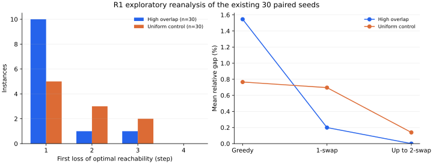

# R1：Greedy 在哪一步失去最优可达性，交换能否修复？

这批已有样本呈现出两种不同的失效特征：高重叠组的 12 个 Greedy 失败实例中，
8 个在首次失效步有另一个最大边际候选能保留最优可达性；均匀对照组的 10 个失败
实例均没有这种一步替代。标准一换一修复了高重叠组的 10 个失败实例，对照组没有
实例完全恢复到最优；允许至多二换二后，两组分别恢复了 12 个和 8 个。

这是对原 pilot 的探索性重分析，样本和原先主检验均未改变。下面的分类描述已观察
路径，不证明换一套平局规则就一定改善整段 Greedy，也不把两组差异单独归因于重叠。

## 方法与数据

使用[原配置](../experiments/core_rq/overlap_pilot_v1/config.json)和
[原始运行结果](../experiments/core_rq/overlap_pilot_v1/raw_results.csv)重建全部
60 个实例，仍为 30 对 seed。每个实例有 48 个元素、16 个候选集合和预算 4。
源代码基线为合并后的 `285c3b0`；
[本轮设计](r1_prefix_exchange_design.md)固定了样本、指标、停止条件和功能样例。

每个实例枚举全部 `C(16,4)=1820` 个选择，直接得到精确最优值 `O`。对每个 Greedy
前缀 `P_t`，计算所有包含该前缀的 k 元选择中的最好覆盖 `O_t`，首次 `O_t<O` 的
步骤记为 `t*`。每个已观察前缀的全部最大边际候选都经过受限枚举。

原 CSV 保存的是排序后的终点选集。分析程序按原算法的最大边际、低索引平局规则
重建决策顺序，并核对终点集合；没有把 CSV 排序误当选择顺序。

一换一终点来自现有 `local_search`；轨迹重建同时核对其终点与邻居评估数。
之后执行包含一换一的至多二换二严格最佳改善，等值改善按
`(交换大小, 移除索引元组, 加入索引元组)` 稳定选择。本轮 60 个实例的完整邻域检查
全部完成，没有预算耗尽的实例。

## 结果

完整数字见[逐实例汇总](../experiments/r1_prefix_exchange_v1/instance_summary.csv)和
[分组汇总](../experiments/r1_prefix_exchange_v1/case_summary.csv)。

| 指标 | 高重叠组 | 均匀对照组 |
| --- | ---: | ---: |
| 全部实例 | 30 | 30 |
| Greedy 失败 | 12 | 10 |
| 首次失效可由同一步替代平局候选避免 | 8 | 0 |
| 当前前缀的所有最大增益候选均损失最优可达性 | 4 | 10 |
| 平局可避免比例：以失败实例为分母 | 8/12 = 66.67% | 0/10 = 0% |
| 平局可避免比例：以全部实例为分母 | 8/30 = 26.67% | 0/30 = 0% |
| 一换一恢复到最优的原失败实例 | 10 | 0 |
| 至多二换二累计恢复到最优的原失败实例 | 12 | 8 |
| 至多二换二停止后仍低于最优 | 0 | 2 |

一换一后共有 12 个实例仍未到最优，二换二又修复其中 10 个。对照组一换一的平均
gap 略有下降，但这不等同于恢复到最优，因此同时保留了恢复数和平均 gap。

| 全部实例的平均相对 gap | 高重叠组 | 均匀对照组 |
| --- | ---: | ---: |
| Greedy | 1.5456% | 0.7654% |
| 一换一后 | 0.1994% | 0.6959% |
| 至多二换二后 | 0% | 0.1389% |

首次失效发生在第 1、2、3、4 步的实例数，高重叠组分别为 `10,1,1,0`，对照组
分别为 `5,3,2,0`。大多数失败在第一步就失去最优可达性，但仍有 7 个失败实例
发生在更晚的步骤，单看第一步不足以解释全部失败。



## 功能样例与独立核验

六个固定小样例独立于 pilot，只用于验证定义和停止语义：

| 样例 | Greedy → 一换一 → 至多二换二 | 精确最优 | 核验重点 |
| --- | --- | ---: | --- |
| multiple_optima | 4 → 4 → 4 | 4 | 有两个最优选择，不把偏离其中一个误判为失效 |
| avoidable_tie | 6 → 8 → 8 | 8 | 全部平局候选被枚举，替代候选能保留最优可达性 |
| unique_bait | 7 → 8 → 8 | 8 | 唯一最大增益候选也可能造成首次失效 |
| two_swap_escape | 6 → 6 → 8 | 8 | 一换一停住，二换二能严格改善 |
| two_swap_stall | 10 → 10 → 10 | 12 | 至多二换二局部最优也可低于全局最优 |
| zero_objective | 0 → 0 → 0 | 0 | 相对 gap 未定义，保存为空值 |

[独立验证器](validate_greedy_failure_paths.py)使用 Python 集合并集和直接受限枚举，
没有复用分析程序的覆盖值、前缀或交换计算函数。它重算了全部 66 个实例的轨迹和
两张 CSV，均通过；对最优值、计数、候选遗漏、交换选择、预算停止标签及汇总数字
的 10 类篡改均能拒绝。

预算边界还单独检查了 `two_swap_escape`：评估预算为 0/4/5/10 时，终点覆盖分别
为 6/6/8/8，只有预算 10 的完整终止扫描支持 `local_optimum` 标签。预算 5 虽已
到全局最优，但还未完成下一轮局部邻域检查，记录仍为 `budget_exhausted`。

## 解释、局限与下一步

这次测试支持继续区分“首个错误决策的可避免性”和“终点交换修复难度”。两者衡量
的是不同阶段：替代候选只证明仍存在某种最优完成方式，后续继续使用 Greedy 未必
会选择它；局部搜索则可以换掉已选集合，其成功不代表原前缀仍可扩展到最优。

对照组剩下的 2 个实例经完整扫描属于当前严格至多二换二邻域的停滞点。这个结果
不证明其他邻域、允许等值移动的搜索或其他初始化也会停住。

本轮不作新的显著性检验。原有 30 对样本、多个前缀和交换轮次不能被当作更多独立
样本。高重叠组与对照组还有并集大小和元素频率等差异，不能从本表作单一结构的
因果判断。若进入 R1c，应另定新样本量、seed 和主指标；本轮到完整探索报告即止。

## 复现

在仓库根目录，安装 Matplotlib 后运行（不绘图时加 `--no-plot`）：

```console
python analysis/greedy_failure_paths.py --design analysis/r1_prefix_exchange_design.json --output results/r1_prefix_exchange_reproduction
python analysis/validate_greedy_failure_paths.py --design analysis/r1_prefix_exchange_design.json --output results/r1_prefix_exchange_reproduction
python -m unittest discover -s tests -p test_greedy_failure_paths.py -v
```

逐实例完整集合、前缀、所有平局候选和交换轨迹保存在
[paths.jsonl](../experiments/r1_prefix_exchange_v1/paths.jsonl)。
输出目录须为空或不存在；原始 pilot 文件保持原样。
