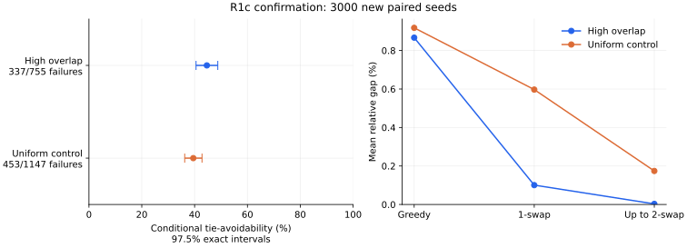

# R1c：新样本尚不足以确定条件比例差异的方向

在预先固定的 3000 对新种子中，高重叠组的 755 个 Greedy 失败实例里，
337 个在首次失效步存在能保留最优完成方式的替代平局候选（44.64%）；
uniform 对照组对应为 453/1147（39.49%）。
唯一主差值（高重叠减对照）为 **5.14 个百分点**，预定的保守 95% 区间为 **[-2.25, 12.52] 个百分点**。
区间总宽度 14.78 个百分点，达到预定的不超过 20 个百分点的精度目标。

本轮到固定样本全部完成即停止，没有追加种子、筛除不利实例或更换主指标。
该结论比较两个指定模型各自失败子集的机制组成，不把差异单独归因于重叠。

## 方法与数据

[设计](r1c_confirmation_design.md)在正式生成前固定了样本、指标、区间和停止规则；
[配置](../experiments/r1c_confirmation_v1/config.json)为 `N=48, M=16, k=4`，高重叠参数 `0.5/0.8/0.05`，
uniform 密度 `0.425`。两组共享配对 seed，实际范围为 `14525675900305775728..14525675900305778727`。
所有 6000 个实例及 12,000 条 Greedy/穷举运行记录均完成，
每个参考都由穷举证明为 `optimal`。原 pilot 的 30 对和资源预检的 32 对均未混入。

首次失效为前缀受限最优值首次低于全局最优的步骤；完整检查该步所有最大增益候选。
一换一从标准 Greedy 终点开始，随后执行包含一换一的至多二换二严格最佳改善。
所有轨迹完成完整邻域检查；没有把预算耗尽记为局部最优。

每组对 `X/M` 使用 97.5% 双侧 Clopper–Pearson 区间，以
`[L_H−U_U, U_H−L_U]` 构造至少 95% 覆盖的主差值区间。
它允许对内相关，代价是保守；多个前缀和交换轮次不增加独立样本量。
本批不另作主 p 值检验，辅助失效率、gap 和交换指标不用于显著性筛选。
完整精度计算及方法来源见设计文档。

## 结果

数字直接来自[组汇总](../experiments/r1c_confirmation_v1/group_summary.csv)与[主汇总](../experiments/r1c_confirmation_v1/primary_summary.csv)。
平均 gap 包含最优实例的零值，零最优值的不可定义情况单独计数。
显示值按百分比小数位四舍五入，区间宽度使用未舍入端点计算。

| 指标 | 高重叠组 | uniform 对照组 |
| --- | ---: | ---: |
| 实例数 N | 3000 | 3000 |
| Greedy 失败数 M | 755 | 1147 |
| 首次失效可由替代平局候选避免 X | 337 | 453 |
| 条件比例 X/M | 44.64% | 39.49% |
| 97.5% 精确区间 | [40.55%, 48.78%] | [36.25%, 42.80%] |
| 全实例 Greedy 失效率 M/N | 25.17% | 38.23% |
| 全实例平局可避免比例 X/N | 11.23% | 15.10% |
| 一换一修复的原失败实例 | 657 | 372 |
| 一换一修复比例（原失败实例为分母） | 87.02% | 32.43% |
| 至多二换二累计修复的原失败实例 | 752 | 905 |
| 至多二换二累计修复比例 | 99.60% | 78.90% |
| 至多二换二后仍低于最优 | 3 | 242 |
| Greedy 平均相对 gap | 0.8668% | 0.9177% |
| 一换一后平均相对 gap | 0.1006% | 0.5970% |
| 至多二换二后平均相对 gap | 0.0030% | 0.1741% |
| 相对 gap 的有效实例数 | 3000 | 3000 |
| 零最优值实例数 | 0 | 0 |

首次失效步骤分布如下，分母为各组原始 Greedy 失败实例：

| 首次失效步 | 高重叠组 | uniform 对照组 |
| --- | ---: | ---: |
| 1 | 655 | 423 |
| 2 | 87 | 430 |
| 3 | 13 | 294 |
| 4 | 0 | 0 |



左图为各组 97.5% 精确区间；主差值使用上文的 95% 保守区间。
右图使用全体有定义实例的平均相对 gap，不以是否修复成功筛选分母。

## 解释与局限

预定方向判断为 `inconclusive`，精度达标为 `True`。
方向证据与估计精度分别报告。这里的平局可避免只意味着存在某个仍可完成到最优的
替代候选，不保证后续继续运行 Greedy 就会到达最优，也没有评估新的平局算法。
交换修复发生在终点之后，它与原前缀是否仍可扩展到最优是不同问题。

原探索样本中对照组的 0/10，不能推广为“对照模型不存在平局可避免失败”。
本批对照组观察到 453/1147；按预定区间，主差异的方向仍不确定。
原探索结果保留为提出问题的依据，不与新样本合并后重新检验。

本批样本中，两组总体失效率分别为 25.17% 和 38.23%，
全实例平局可避免比例分别为 11.23% 和 15.10%。
这与条件比例回答的是不同问题，不能将分母换成全体实例后仍称作主指标。
交换后仍低于最优的数量为 3 和 242；这些辅助结果
保留其描述性身份，没有追加显著性检验。

结果仅适用于这两个生成机制、固定尺寸、集合索引与低索引平局裁决。
两组并集和元素频率等性质也会变化，且两个条件比例的失败子集不同；本批没有识别
重叠的单一因果效应。仍低于最优的二换二终点只说明当前严格邻域停滞，不能外推
到允许等值移动、其他初始化或更大的交换邻域。原 pilot 的失效率主检验保持原结论。

## 执行与复现

算法与分析执行基线为 `8fc14108577a3c8862a7b21a89113f78edfe7664`，开始时工作区干净。
Python 3.12.14、SciPy 1.18.1、
Matplotlib 3.11.1；完整环境见[运行上下文](../experiments/r1c_confirmation_v1/run_context.json)。

首轮使用默认逐条 checkpoint，CSV 原子替换返回过 `WinError 5`。尝试停止旧进程时
进程工具也返回异常；随后核实无遗留写入进程，完成同批续跑及集中写入检查。
续跑保留 3,073 条既有算法记录，未改种子；规范化的 optimum/gap 可随参考补齐。
中间续跑使用 `checkpoint_interval=200`，随后按本次会话要求改为集中写入
（`checkpoint_interval=12001`）。最终确认没有再次执行算法，12,000 条原始记录
逐字节不变。每阶段实际状态与耗时见[执行记录](../experiments/r1c_confirmation_v1/execution.jsonl)。
这些操作耗时不构成算法速度或通用性能比较。

原始输入为 [instances.csv](../experiments/r1c_confirmation_v1/instances.csv) 和 [raw_results.csv](../experiments/r1c_confirmation_v1/raw_results.csv)；
完整轨迹见 [paths.jsonl](../experiments/r1c_confirmation_v1/paths.jsonl)，逐实例指标见
[instance_summary.csv](../experiments/r1c_confirmation_v1/instance_summary.csv)。独立验证器重建全部实例、
重新枚举最优完成和交换邻域，并核对来源身份、选集、全部轨迹及三张汇总表。

使用已有归档重建分析（目标目录必须不存在）：

```console
python analysis/r1c_confirmation.py --config 'experiments/r1c_confirmation_v1/config.json' --results 'experiments/r1c_confirmation_v1' --output results/r1c_confirmation_reproduction
python analysis/validate_r1c_confirmation.py --config 'experiments/r1c_confirmation_v1/config.json' --results 'experiments/r1c_confirmation_v1' --output results/r1c_confirmation_reproduction
```

从种子重新运行 benchmark 的命令见[使用指南](r1c_confirmation_usage.md)。本次集中
写入使用已有 Python API 的 `checkpoint_interval=12001` 参数，仅改变保存频率，
没有修改仓库默认值。表格与图由以下命令从已独立验证的归档 CSV 生成：

```console
python analysis/render_r1c_confirmation_report.py --data 'experiments/r1c_confirmation_v1' --output 'analysis/r1c_confirmation_report.md'
```

本批已完成 R1c。后续若研究新平局规则、预算网格或结构因果解释，须另定实验，
不把本批未预定的分析追认为确认性结论。
