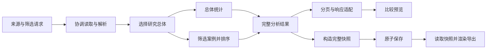

# 可复用组件与功能编排：首版设计

状态：首轮组件化试验已实现，验证结果见[实验记录](component_composition_experiment.zh-CN.md)。原设计基于本地 `main` 的 `3de1200`，2026-09-21。下文保留设计目标；实际提取边界及尚未实施部分以实验记录为准。

## 目标与当前状态

目标是让功能通过稳定组件的组合实现：新增功能主要编写编排函数，已有能力通过显式输入输出连接。首轮用“比较预览”和“保存比较快照”两个真实功能验证设计，再考虑接入更多研究分析。

最初交付是组件边界、数据契约、组合示例和实施验收计划。后续首轮试验按此目标提取比较计算和快照组件，未改变算法、CSV、HTTP 接口、实验配置或任务执行方式。

当前代码已经具备复用基础：

- [`dashboard_workbench.py`](../src/maxcover/dashboard_workbench.py) 的 `WorkbenchService.compare` 支持 Benchmark CSV 和 R1 轨迹的比较，但一个方法同时承担来源签名、缓存、读取、筛选、分组统计、排序和分页。
- [`dashboard_exports.py`](../src/maxcover/dashboard_exports.py) 的 `ComparisonExports.save` 已通过 `compare(include_all=True)` 复用比较逻辑；同时构造自己的 `WorkbenchService`，并通过其私有 `_file` 方法访问快照路径。当前问题是职责与依赖边界，不是两套独立比较算法。
- [`dashboard.py`](../src/maxcover/dashboard.py) 的 `DashboardService` 组装服务；`read_artifacts` 借助 `JobService.reading_outputs` 协调数据读取与后台写入。新入口也必须经过这项协调。
- [`dashboard_index.py`](../src/maxcover/dashboard_index.py) 已提供带解析器版本和文件变化检测的索引，不需要新造缓存系统。
- [`dashboard_analysis.py`](../src/maxcover/dashboard_analysis.py) 已有 R2–R4 数据解析、筛选、分布和配对功能。R3 按原图维持完整端点配对；R2 预算比较检查原图成员一致，不能直接用通用行筛选替代。
- [`benchmark.py`](../src/maxcover/benchmark.py) 的 `summarize_benchmark` 已检查完整 checkpoint，再复用 `run_benchmark` 重建输出。它会写出派生产物，不应包装成只读分析组件。

## 设计选择

组件分三类：纯计算函数、管理外部资源的适配器、表达功能的编排函数。一个能力只有在具有独立输入输出且能解释其用途时才成为组件；不要求每个步骤都建类。

依赖方向：入口 → 功能编排 → 计算组件与资源接口；文件和索引适配器实现资源接口。计算组件不依赖 HTTP、Dashboard 服务、项目根目录或后台任务。

首版由 Python 函数显式连接组件。参数决定来源、筛选条件和分页，代码决定合法步骤与统计分支。暂不引入动态插件发现、任意步骤 JSON、DAG 调度器、可视化拖拽或全局服务注册器。等到稳定组件在多个功能中被实际使用，再评估声明式编排。

## 首轮组件边界

下面名称均为拟议接口，不是已经存在的 API。

### 资源组件

`ComparisonReader.read(sources) -> ComparisonInput`：读取指定来源的完整比较记录，通过现有 CSV/R1 解析器和 `DashboardIndex` 实现。保留来源路径检查、身份检查、读取前后来源变化检测和输入顺序。它不接受 outcome 或分页参数。

`SnapshotStore.save(snapshot) -> SavedComparison` 与 `load(id)`：负责快照路径、原子写入和读取验证；保存具体记录和统计值，不能只保存来源路径。资源路径逻辑拥有明确接口，不再通过另一个功能服务的私有方法访问。首轮只提取比较快照所需逻辑，不合并全仓库的路径策略。

`ReadCoordinator.hold(sources)`：复用现有 `reading_outputs` 语义，由应用装配提供。同一受保护读取范围内完成输入加载与来源变化检查，再将独立的内存结果交给后续步骤。CLI 或 Notebook 接入时也必须提供协调适配器，不能默认使用空锁绕过活跃写入。

### 计算组件

- `select_population(input, selection) -> PopulationRows`：按 case、algorithm、population 选择研究总体，保留输入计数及可选项来源。
- `summarize_population(population) -> ComparisonSummary`：按现有 source、case、algorithm、population、维度及 options 分组，保留缺失参考值、错误和超时的原有计算口径。
- `select_outcomes(population, outcome) -> SelectedRows`：选择全部、失败、零差距或缺失参考值记录，按现有 gap/source/key 规则稳定排序。
- `paginate(selected, page_request) -> RecordPage`：只裁剪展示记录，保留 total、pages 和现有越界页收敛行为。
- `assemble_snapshot(analysis, metadata) -> ComparisonSnapshot`：组合完整选中记录与总体统计；接收外部提供的 ID 和保存时间，自身不读取时钟或生成随机 ID。
- `render_snapshot(snapshot, format) -> ExportArtifact`：保留 CSV、Markdown、SVG、JSON 的既有输出语义及转义行为，不重新读取原始来源或计算实验结果。

统计和筛选函数不得修改输入行。输入内部可以先沿用只读约定下的现有记录映射；实施时为稳定字段补充 TypedDict，并用显式容器表达不同阶段。无需立即迁移所有领域模型。

### 编排组件

`analyze_comparison(reader, coordinator, request) -> ComparisonAnalysis`：验证请求，协调读取，生成总体与案例两条分支，再组合完整分析结果。

`preview_comparison(analysis, page_request) -> ComparisonPage`：分页并适配现有 HTTP 响应。

`save_comparison(analysis, metadata, store) -> SavedComparison`：构造并保存全量快照。现有 `ComparisonExports.save(payload)` 保留为兼容入口，在内部先调用分析编排，再调用保存编排。

分析编排返回的内容由后端计算，不能直接信任客户端提交的 records/summaries。用户点击保存时仍重新读取并校验当前来源；若期间来源变化，遵循现有语义保存点击时分析的值或拒绝不一致读取，不承诺保存此前屏幕预览的版本。

## 数据契约与组合规则

`ComparisonRequest` 只含来源与 case/algorithm/population/outcome。`PageRequest` 独立，防止分页污染统计与保存。继续限制 1–4 个不同来源及既有分页上限。

`ComparisonInput` 含来源顺序、完整记录和输入计数；记录保留 source/key、config/case/instance/run 标识、population、维度、参数、算法选项、coverage、optimum、gap、runtime、status、selected 和种子字符串。复用现有解析结果，不改变磁盘 schema，也不把大型种子转为浮点数。

`PopulationRows` 与 `SelectedRows` 是不同的内部容器，而非可任意互换的 list 别名。前者表示总体筛选后的完整数据，后者表示 outcome 筛选后的展示/导出集合。`summarize_population` 只接受前者；分页只接受后者。静态类型检查帮助发现接线错误，边界验证负责外部输入合法性。

`ComparisonAnalysis` 含 sources、input_records、filtered_records、summaries、cases、algorithms 和完整 selected records。`ComparisonPage` 才含 page/pages/page_size。内部模型由适配函数转换为既有响应和快照结构；保留已有快照中的分页元数据，不能因内部拆分悄悄变更文件格式。

合法组合必须遵循以下语义：

- 总体统计先于 outcome 筛选；缺失 gap 不按零失败处理，失败率分母仍为有效 gap 记录数。
- cases/algorithms 来自完整输入；summaries 来自总体筛选结果；total 来自 outcome 筛选结果。
- 全量 selected records 交给保存组件；分页结果不能直接接到保存接口。
- 缺失/未经证明的最优值不能因归一化而变成已证明最优值。首轮沿用既有合法性验证，不扩大科学证明范围。
- 领域不同的数据需要专门适配器与语义校验。R3 配对单位不是一行 endpoint，R2 配对不能仅按 seed 连接；首轮不让这些数据进入比较组件。

## 两个功能如何组合



以下是接口草图，不是可执行示例：

```python
def analyze_comparison(reader, coordinator, request):
    validate_request(request)
    with coordinator.hold(request.sources):
        inputs = reader.read(request.sources)
    population = select_population(inputs, request.selection)
    summary = summarize_population(population)
    selected = select_outcomes(population, request.outcome)
    return assemble_analysis(inputs, population, summary, selected)

# 功能一：预览
analysis = analyze_comparison(reader, coordinator, request)
response = preview_comparison(analysis, page_request)

# 功能二：保存；实际请求独立执行，不依赖浏览器中的预览记录
analysis = analyze_comparison(reader, coordinator, request)
saved = save_comparison(analysis, metadata, snapshot_store)
```

未来的“失败案例包”可以复用完整分析与 select_outcomes，再连接实例解析和案例导出。该功能只作为扩展性检查，不在首轮实现范围。

## 执行、缓存与错误归属

保留现有 `DashboardIndex` 的缓存与失效机制。第一步仍由旧服务持有比较结果缓存及其来源签名检查；不要为证明组件化而迁移缓存、共享所有服务实例或增加持久化缓存。去掉缓存后的性能是否变化，不可凭设计断言。

输入格式或筛选错误在请求边界拒绝；数据读取/变化错误由资源适配器报告；统计输入不满足契约由计算边界报告；写入失败不能返回保存成功。旧入口继续映射为现有异常和 HTTP 状态。

不引入自动重试。快照保存是显式写操作，每次调用目前生成新 ID；读取重试和保存重试不能共用一个通用策略。`JobService` 继续独占后台任务生命周期、锁、暂停、取消与恢复，首轮组件不启动算法任务。

只读分析不重新求解最优值，也不重新生成实验。已有 summarize 重建输出和新 Benchmark 执行是不同的带副作用能力，后续若纳入编排，应作为有明确输出目录和恢复语义的独立操作。

## 实施顺序与停止条件

1. **核对兼容边界。** 使用已有 Workbench/Exports fixtures 记录预览、全量结果与快照行为；特别核对 outcome 分母、顺序、缺失值、空选择和超过一页的数据。无需重跑研究基线。
2. **提取纯计算组件。** 拟新增 `src/maxcover/comparison.py`，容纳阶段类型与纯函数。`WorkbenchService.compare` 保留签名、读取、缓存和响应结构，转调新函数；先不改变存储。
3. **提取功能编排及快照边界。** 拟新增 `src/maxcover/comparison_workflows.py`，定义必要的窄资源接口与编排。文件适配实现继续靠近原模块，`DashboardService` 负责明确装配。保留 `WorkbenchService`、`ComparisonExports` 既有构造方式和入口。仅在真实替换需求出现时引入 Protocol，避免给每个函数包一层接口。
4. **验证两个功能的组合。** 预览和保存经过同一分析编排，分页与全量快照分支分别验证；渲染只消费保存的值。完成后停止，不迁移 R2–R4、Benchmark runner 或前端页面。

预期改动集中于两个新增模块，以及 `dashboard_workbench.py`、`dashboard_exports.py`、`dashboard.py` 的必要委托/装配与相关测试。实施中若需要更改 CSV、研究语义或任务状态机，应将该部分另列设计，不纳入机械提取。

首轮验收：

- 两个功能调用同一个分析编排和统计实现，调用者只选择展示或保存的后续组件；不保留平行统计实现。
- 计算组件可以用内存记录调用，无 HTTP 服务、根目录或求解器依赖；不得就地修改输入。
- 现有 `test_dashboard_workbench.py`、`test_dashboard_exports.py`、`test_dashboard_cached_readers.py`、`test_dashboard_index.py` 中受影响行为通过；新增测试只覆盖未被现有测试证明的组合边界。
- 使用至少两页数据验证全量导出；用 loss 筛选验证分母不变；用缺失参考、空选择、非法筛选、损坏来源及读取中来源变化验证拒绝/空值行为。
- 保存后替换原始文件并重启读取，导出值保持不变；确定性字段与原有输出一致，ID/时间等非确定性字段按语义验证。
- 检查 HTTP 读取协调未被绕过、活跃输出冲突仍被拒绝。新入口如接入 CLI/Notebook，必须单独验证同一保护语义。
- 实施后运行仓库要求的 `python scripts/check.py`；合并前按 AGENTS 要求完成独立行为审查，包括有效和无效输入。

## 本轮核查与后续决策

设计阶段通过源码检查确认上述复用点及统计分支；后续试验的实现、行为比较和检查结果单独记录在[实验记录](component_composition_experiment.zh-CN.md)，不将行为兼容性解释为性能结果。

当前明确选择后端数据处理与功能编排作为首轮范围。UI 卡片/筛选器复用、用户自定义工作流、跨研究数据适配分别需要实际使用场景；待首轮两个功能完成后，再选择下一项。若两个调用方依旧需要修改公共组件内部的功能名分支，说明边界不成立，应调整本设计而非继续增加配置开关。
