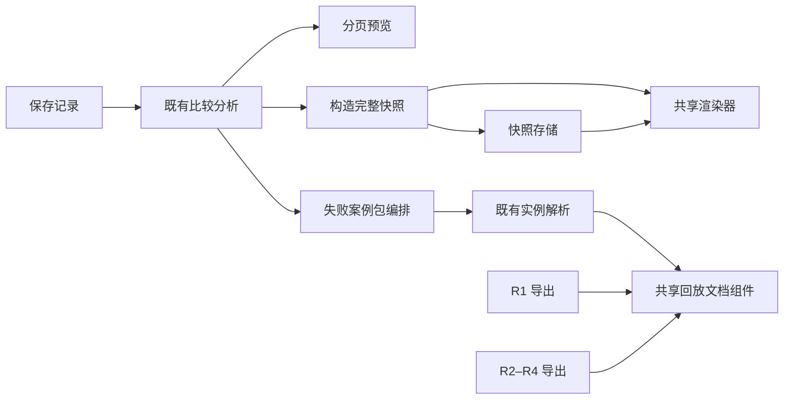

# 组件共享扩展试验

## 结果与范围

沿用 `codex/component-composition-design-20260921` 工作树，在[首轮试验](component_composition_experiment.zh-CN.md)之上扩大共享。此次完成三项接入：内存快照与已保存快照共用四种渲染器；R1 与 R2–R4 实例导出共用回放文档组件；新增失败案例包编排，复用既有比较分析、案例解析与回放能力。

实际示例读取已有 R1 轨迹，研究总体仍为 60 条，筛选出 22 个失败案例，完整导出 22 份可回放文档，并逐份通过 Greedy 回放核对。输出同时包含 JSON、CSV、Markdown、SVG。没有新增研究样本或重新证明最优值。

旧功能兼容检查通过：432 组比较响应、8 组快照、28 份导出字节，以及 66 份 R1 和 23 份 R2–R4 回放文档的序列化输出一致；既有 7 组非法比较请求、4 组空数据 SVG 拒绝也保持一致。新增 5 个组件测试通过，57 个源码文件类型检查通过。

最终日常检查 `scripts/check.py` 退出码 0：675 项中 651 项通过、24 项按既有环境/平台条件跳过，耗时 261.877 秒；必需研究验证成功执行，随后 mypy 对 57 个源码文件检查通过。跳过项包括可选 Rust 扩展、Matplotlib、OR-Tools、显式 CUDA 硬件检查及 POSIX 专项，不代表本轮验证了这些能力；这是日常 profile，不是 full profile。

## 共享规模具体扩大在哪里

**渲染组件：** [`comparison_rendering.py`](../src/maxcover/comparison_rendering.py) 提供 `render_snapshot(snapshot, format_name)`，只接收完整快照并返回内容字节、媒体类型和文件名。原 `ComparisonExports.artifact` 委托它执行；新的内存导出示例可直接使用它，无需先写入 Dashboard 快照存储。CSV 大整数种子与公式转义、Markdown/SVG 文本转义、空数据拒绝保持原样。生产快照下载与实验性内存导出是两个消费者，不把四种文件格式计作四个独立业务功能。

**回放文档组件：** [`replay_documents.py`](../src/maxcover/replay_documents.py) 的 `greedy_replay_document` 接收实例、已保存覆盖值、已排序选集和来源信息，检查选集大小、索引、唯一性与覆盖一致性，再构造独立的回放文档。两个既有入口 `WorkbenchService.export` 和 `StudyAnalysisService.export_instance` 共用它，新失败案例包也复用其检查。它不运行 Greedy、精确求解器或统计推断。

**新增功能编排：** [`case_workflows.py`](../src/maxcover/case_workflows.py) 的 `assemble_failure_bundle(analysis, resolve, maximum_cases=100)` 接收完整的 loss 筛选分析和一个实例解析函数。它沿用已有排序及总体统计，调用解析函数恢复实例，并检查返回的来源、记录键、原始实例标识、算法、选集和覆盖值与所选记录一致。



这轮没有修改首轮的 `comparison.py`、`comparison_workflows.py` 或既有分组统计。新增消费者通过连接既有输出与窄解析接口实现，是本次扩展性试验的关键结果。

## 新编排的边界

- 输入必须是完整 `ComparisonAnalysis`，且已指定 `outcome="loss"`；当前只导出 Greedy 的正 gap 记录，不能把其他算法的结果配上 Greedy 回放。
- 默认最多解析 100 个案例，允许显式选择 1–200。排序不变；`selected_cases`、`exported_cases` 和 `truncated` 明示限制。总体统计和全部筛选记录不随解析上限缩减。
- 任一待导出实例无法恢复或与记录不一致时，整个调用失败，不静默漏掉该案例。空选择返回空包，不调用解析器。
- 这是内存编排，不自动写文件。文件型解析器所涉及的全部来源必须由调用者协调读取；示例只读一个 R1 来源，并将分析与实例解析放在同一次 `read_artifacts` 范围内。组件不会猜测其他来源的锁范围。
- 新功能目前是可调用 Python 接口和可运行示例，没有新增 Dashboard 按钮、HTTP 路由、持久任务、动态插件或拖拽编排器。案例包结构是本轮试验输出，不修改既有 Benchmark CSV 或研究 schema。

R1 导出中的实例会省略原始 family/seed 等元数据，R2–R4 则保留研究实例元数据。因此共享回放组件不把回放实例重新计算的完整哈希强行等同于来源记录标识。原始身份、研究配对、R3 端点、参考值状态等校验留在各自适配器中；案例包另外要求解析器返回的原始来源标识与输入记录相同。结构可回放不等同于新的最优性证明。

## 可复用的组合方式

以下是连接顺序；完整可运行版本见[示例脚本](../results/component_composition_expansion/demo.py)：

```python
# 将下面的读取与解析一起放在现有 read_artifacts 协调范围中。
analysis = workbench.analyze(sources, ComparisonSelection(outcome="loss"))
bundle = assemble_failure_bundle(analysis, workbench.export)
snapshot = assemble_snapshot(
    analysis, identifier=view_id, saved_at=timestamp, title=title,
)
content, media_type, filename = render_snapshot(snapshot, "csv")
```

调用方可以改变案例解析数量、输出格式和后续存储位置，而不改统计或回放组件。`resolve` 是读取所选 source/key 的窄函数，不需要继承公共服务基类。研究适配器的差异仍明确存在。

## 验证与产物

扩展前，研究分析模块 12 项测试通过。新增 5 项测试验证内存/落盘渲染字节一致、转义与种子精度、输入不被修改、案例上限、完整分母、错误来源拒绝、缺失实例不被跳过、空选择和回放选集/覆盖值合法性。测试用三个实际保存案例额外执行了 Greedy 回放。

兼容比较以 Git 基线 `3de1200` 的旧模块作为对照。R1 使用仓库保存的 66 条轨迹；R2/R4/R4 DUAL 使用两张小型功能夹具、三个预算；R3 使用原图及四个端点，合计 23 份研究回放文档。夹具只验证软件行为，不作为新增研究结果。底层研究读取器未改变且为比较双方共用，这不是两个完整独立环境的全量复现。

本地证据位于 Git 忽略目录 `results/component_composition_expansion/`：

- [失败案例包 JSON](../results/component_composition_expansion/bundle.json) 与 [22 份回放文件目录](../results/component_composition_expansion/failure_cases/)。
- [比较摘要](../results/component_composition_expansion/comparison.md)、[CSV](../results/component_composition_expansion/comparison.csv)、[SVG](../results/component_composition_expansion/comparison.svg)、[JSON](../results/component_composition_expansion/comparison.json)。
- [实际组合结果](../results/component_composition_expansion/demo-result.json)、[回放兼容结果](../results/component_composition_expansion/replay-parity.json)、[比较兼容日志](../results/component_composition_expansion/comparison-parity.log)、[日常检查日志](../results/component_composition_expansion/check.log)。

这些文件保留在当前工作树，不随 Git 文档自动发布。相邻 `wt-fast-verification/.venv` 提供已有依赖，未修改共享环境。

```console
python -m unittest discover -s tests -p test_component_expansion.py -v
python results/component_composition_expansion/replay_parity.py
python results/component_composition_expansion/demo.py
python scripts/check.py
```

本轮到上述消费者停止。没有测量性能、内存峰值或新增消费者所节省的开发时间；更多数据类型接入时仍应先确认其身份、配对单位和参考值语义，不能仅因字段名称相似就共用研究计算。
