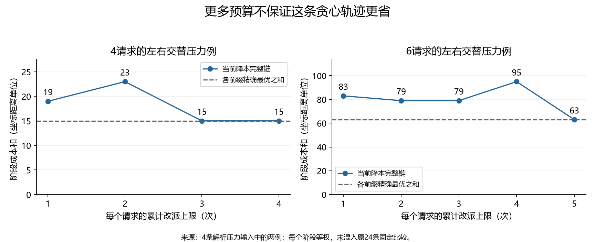
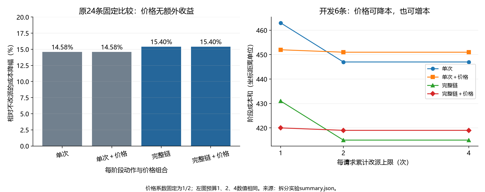

# 有限改派在线匹配：六分支继续研究结果

本轮对六条分支分别给出了数学结论、连续决策程序或精确有限比较，证据见第1节。
最直接的修正是：原24条比较中的额外收益来自链长，而非价格；新的压力例证明贪心策略多拿预算也可能更差。
指定FSTTCS 2026论文仍未取得全文，本轮另读三篇2026原始论文的相关正文，因此保留新颖性缺口。

## 1. 六项任务与交付

|分支|本轮可核验结果|证据与限制|
|---|---|---|
|1. 只允许单链|列出全部四个第二步动作，给连续第三请求上的精确比较程序；出现“原子模型保留、单链模型立即改派”的反例|[链动作与自由首步](链动作与自由首步.md)第2至4节；三个请求、一次预算|
|2. 自由选择首步|给出连续域的完整 `min首步 max第二请求 min第二动作 max第三请求` 决策程序；最近点可严格次优|同报告第5至7节；原子模型、有理数输入精确实现|
|3. 更多请求与预算2/4|证明全前缀精确性最坏需要n−1次；四条压力序列展示第三至第五次机会；求解四请求有限博弈并给连续域收敛上下界|[更多请求与策略拆分](更多请求与策略拆分.md)第2节；连续预算1/2仍是区间，预算4精确为0|
|4. 链长与价格拆分|完成2×2组合、三个预算的同输入比较，并核查四个价格系数|同报告第3节；系数敏感性仅限原开发6条|
|5. 随机化|证明固定最近首步下，随机化不能改善累计超额；原始成本却有严格改善例，并给双方有理数证书|[随机化与原始成本](随机化与原始成本.md)第3、5、6节；区分对手是否看到抽样|
|6. 原始成本最坏目标|给任意三点前缀的三个闭式候选分数，以及连续随机化的有限线性规划形式|同报告第4至6节；不再只限第二请求位于中间服务点的特例|

原子模型允许同时交换旧请求，更新前后保持唯一占用。单链模型只允许新请求到空点的一条简单增广链。两种模型均逐请求累计改派次数，首次分配免费。累计超额是每阶段实际距离减去该阶段精确最优，再对阶段相加。

## 2. 两项改变策略选择的三点结果

**只允许单链时，首占中间服务点也可能应当提前改派。** 服务点为(0,2,6)，已到请求为(5/4,2)。单链模型立即把首请求移到0，最坏累计超额为5/2；任何保留动作至少为3。原子模型则应保留，最优值为3/2。这是动作范围改变最优时机的严格反例，不是对代码风格的偏好。证据：链报告第3节及其 `strict_timing_reversal_example`。

**最近点不是自由首步下的普遍最优选择。** 服务点为(0,3,6)，首请求为7/4。首占左端点的完整最坏累计超额是1；首占最近的中间服务点为5/2；首占右端点为11/2。所有数都对未知第二、第三请求取了最坏情况，包含第一步付出的超额。证据：链报告第5节及 `first_results`。

本轮用分段线性函数的交点穷尽连续最坏场景。分段线性（Piecewise Linear）表示每小段都为固定斜率的直线。它让原本连续的未来位置变成有限个有证明依据的候选点。程序没有拿密集网格替代连续证明。

## 3. 预算增加，贪心成本可以上升

**新的四请求例中，预算从1增到2让贪心阶段成本和从19升到23。** 两次执行的前缀成本分别为(1,2,8,8)和(1,2,4,16)。多一次预算让算法第三步追随当前最优，却在第四步被先前决策限制。证据：压力输入 `alternating_radius_n4` 的逐步轨迹。

**六请求例中，预算1、2、4的阶段成本和分别为83、79、95。** 预算5时降为63，达到每个前缀精确最优。这个输入来自可证明的左右交替、距离翻倍构造，未混入原24条比较。

证明不依赖这两个具体规模。对任意n，令服务点为s_i=(-1)^i*2^(i−1)，请求依次为0,s_1,...,s_(n−1)。第t步的最优成本为2^(t−1)。任意最优匹配都把首请求0分给与s_t同侧的点，所以它每步必须换点。保持全部前缀精确最优最坏需要n−1次。完整证明见更多请求报告第2节。

**精确优化后的最优值不会因预算增加变差。** 大预算可以模仿小预算策略。在本轮四请求、五个可选坐标的完整在线博弈中，预算1、2、4的最优最坏累计超额为4、2、0。原子与单链模型在该有限域上相同。

细化为13个整数坐标后，预算1、2的有限最优值为9、2。在线取整证明把它们转成连续区间上的[9,21]与[2,14]界；预算4的连续最优值为0。网格最大间隔为h时，保证区间宽度不超过12h，因而可以继续收敛。没有把有限网格值直接称为连续精确解。

## 4. 原比较中的改进来自哪里

**原24条比较中，链长解释了全部10个额外节省单位。** 单旧请求的阶段成本和为1043，完整链为1033。两个动作范围内，价格从0改为1/2都没有改变这组结果。三个预算1、2、4均如此。证据：拆分汇总 `groups[split=eval]`。

**开发集上的价格既可能有益，也可能有害。** 完整链在预算1下加入价格，成本和从431降到420；预算2下却从415升到419。系数0、1/4、1/2、1都已在开发集检查，没有据此重选正式集策略。

这使下一步的研究重点从“多给预算是否更好”转为“新增机会何时应当不用”。证明一个稳健的选择规则，比单纯提高硬上限更直接。

## 5. 随机化收益取决于目标和对手

**在已固定的三点累计超额目标下，随机化没有收益。** 证明为所有候选动作找到同一个最坏未来点，因此不是把各动作分别取最坏后再错误相加。结论覆盖对手看不到抽样结果，以及看见结果再选未来这两种情况。

**原始成本目标下，随机化可能有收益。** 服务点(0,10,50)、已到请求(6,10)中，确定性最优的第二、三阶段成本和最坏为62。以各半概率保留或左移，最坏期望成本为60。对手以2/3、1/3概率选择未来0或6，给出同值下界，因此60是精确最优。

对手必须看不到本次抽样结果。若它先看见实际动作再选未来，最优仍为62。这项结果不能转化为先前累计超额目标的收益。

## 6. 文献取得与缺口

本轮查找了指定题目的多种写法和作者来源，记录28个代表性定向查询。FSTTCS官网确认题名及作者，但页面没有正文链接。本轮没有取得 *Near Optimal Online Bipartite Matching on the Line with Amortized Logarithmic Recourse* 全文，不能推断它尚未公开。[官方目录](https://www.fsttcs.org.in/2026/papers.php)

新增阅读的三篇正文分别研究增量匹配更新时间、动态直线匹配稳定性、层次树上的随机匹配。它们的服务点到达方式或改派计费与本题不同，不能直接套用保证。逐篇原文、页码、读取范围及本地文件见[补充文献核查](补充文献核查.md)。

本轮结论属于独立推导与小规模研究结果。没有确认理论新颖性，也没有把有限输入性能当成一般竞争比。

## 7. 验证与后续边界

拆分实验448条轨迹、2613个在线阶段已独立核验，180条旧算法轨迹与历史结果相同。链与原子三点模型共核对1690项前缀结果，另检查23个自由首步博弈和48项离网格有理数前缀。随机化核对845个前缀、1690次线性规划。四请求的6个较粗网格在线博弈、3个预知未来对照和4个细网格在线博弈由另一实现复算。证据文件见各专题报告。

两次独立数学审阅复核了连续分段覆盖、随机化共同未来证明和压力族的符号强制性。审阅修正了一句单链例的上界说明：应根据最终最优匹配是否属于禁止的交换来选动作，不能对所有未来都保持旧分配。修正没有改变算法或计算结果。

本轮完成六条分支的实质推导和验证，仍保留三项边界：连续四请求预算1/2只得到收敛上下界；一般长序列的低改派近似保证未证明；指定FSTTCS正文和新颖性核查仍有缺口。下一项最值得继续的问题是，把“预算更多可以主动不使用”写成可证明的长序列策略，而不是继续增加固定阈值变体。
