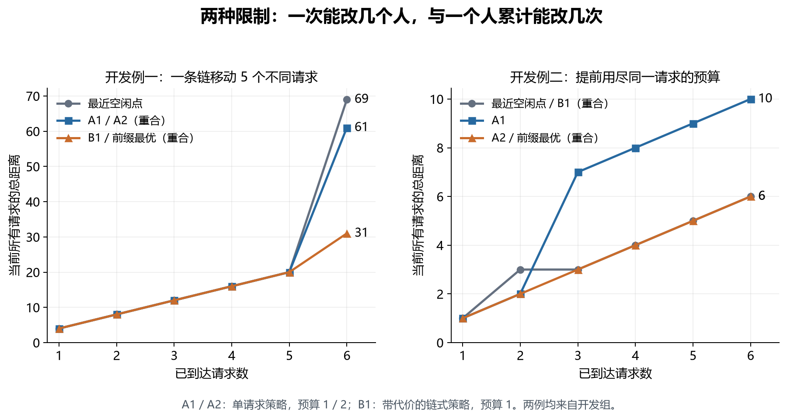

# 两个逐步分配例子

长链例说明一次改变多个不同请求可以有收益；预算耗尽例说明过早追求当前最优可能损害后续阶段。
两例均来自开发组，曾用于理解和选择策略。它们不能作为独立的正式检验。

A1、A2 分别表示单请求改派策略的 1 次、2 次预算。B1 表示带代价的链式策略的 1 次预算。
A 每阶段最多改变一个旧请求，选当前总距离最小的合法动作。B 可以改变一条链上的多个旧请求；每个改派的附加代价等于服务点移动距离除以两倍剩余次数。B 按当前总距离加附加代价选择动作。
前缀最优（Prefix optimum）只对已经到达的请求计算最小总距离。首次分配不计改派。

证据：[固定输入](../output/20260924T175730918352Z-dev/inputs.json)；[逐步记录](../output/20260924T175730918352Z-dev/traces.json)。下文用 case_id、policy、budget、t 定位记录。

## 例一：给每人一次机会，也可以移动整条链

实例编号：`dev_uniform`。服务点坐标为 `[0, 10, 20, 30, 40, 50]`。请求按 `[4, 14, 24, 34, 44, 1]` 的顺序到达。

下表的分配向量按到达顺序排列。例如 `[0, 10]` 表示第一个请求去坐标 0，第二个请求去坐标 10。

### 各阶段成本

| 阶段 | 新请求坐标 | 最近空闲点 | A1 | A2 | B1 | 前缀最优 |
| --- | --- | --- | --- | --- | --- | --- |
| 1 | 4 | 4 | 4 | 4 | 4 | 4 |
| 2 | 14 | 8 | 8 | 8 | 8 | 8 |
| 3 | 24 | 12 | 12 | 12 | 12 | 12 |
| 4 | 34 | 16 | 16 | 16 | 16 | 16 |
| 5 | 44 | 20 | 20 | 20 | 20 | 20 |
| 6 | 1 | 69 | 61 | 61 | 31 | 31 |

### 最近空闲点 的分配变化

记录键：`policy=nearest`，`budget=0`。

| 阶段 | 按到达顺序的服务点坐标 | 本阶段旧请求的实际改派 | 累计改派总数 |
| --- | --- | --- | --- |
| 1 | `[0]` | 无 | 0 |
| 2 | `[0, 10]` | 无 | 0 |
| 3 | `[0, 10, 20]` | 无 | 0 |
| 4 | `[0, 10, 20, 30]` | 无 | 0 |
| 5 | `[0, 10, 20, 30, 40]` | 无 | 0 |
| 6 | `[0, 10, 20, 30, 40, 50]` | 无 | 0 |

### A1 的分配变化

记录键：`policy=single`，`budget=1`。

| 阶段 | 按到达顺序的服务点坐标 | 本阶段旧请求的实际改派 | 累计改派总数 |
| --- | --- | --- | --- |
| 1 | `[0]` | 无 | 0 |
| 2 | `[0, 10]` | 无 | 0 |
| 3 | `[0, 10, 20]` | 无 | 0 |
| 4 | `[0, 10, 20, 30]` | 无 | 0 |
| 5 | `[0, 10, 20, 30, 40]` | 无 | 0 |
| 6 | `[0, 10, 20, 30, 50, 40]` | 请求 5（坐标 44）：40→50 | 1 |

### B1 的分配变化

记录键：`policy=priced_chain`，`budget=1`。

| 阶段 | 按到达顺序的服务点坐标 | 本阶段旧请求的实际改派 | 累计改派总数 |
| --- | --- | --- | --- |
| 1 | `[0]` | 无 | 0 |
| 2 | `[0, 10]` | 无 | 0 |
| 3 | `[0, 10, 20]` | 无 | 0 |
| 4 | `[0, 10, 20, 30]` | 无 | 0 |
| 5 | `[0, 10, 20, 30, 40]` | 无 | 0 |
| 6 | `[10, 20, 30, 40, 50, 0]` | 请求 5（坐标 44）：40→50 请求 4（坐标 34）：30→40 请求 3（坐标 24）：20→30 请求 2（坐标 14）：10→20 请求 1（坐标 4）：0→10 | 5 |

**第六阶段，B1 从空闲点开始反向执行 5 次旧请求改派。** 每个旧请求只改一次，随后将新请求直接分配到坐标 0。总距离为 `5×6+1=31`。A1 只能移动一个旧请求，得到 `4×4+6+39=61`。最近空闲点得到 `5×4+49=69`。定位：本例三个策略的 `t=6`。

A2 的六阶段分配与 A1 相同。本例的限制是每阶段只允许移动一个旧请求；增加单人终身预算没有改变这个动作集合。

## 例二：第二阶段省下 1，却让后面四个阶段各多花 4

实例编号：`dev_budget`。服务点坐标为 `[0, 3, 5, 100, 110, 120]`。请求按 `[2, 3, 0, 101, 111, 119]` 的顺序到达。

下表的分配向量按到达顺序排列。例如 `[0, 10]` 表示第一个请求去坐标 0，第二个请求去坐标 10。

### 各阶段成本

| 阶段 | 新请求坐标 | 最近空闲点 | A1 | A2 | B1 | 前缀最优 |
| --- | --- | --- | --- | --- | --- | --- |
| 1 | 2 | 1 | 1 | 1 | 1 | 1 |
| 2 | 3 | 3 | 2 | 2 | 3 | 2 |
| 3 | 0 | 3 | 7 | 3 | 3 | 3 |
| 4 | 101 | 4 | 8 | 4 | 4 | 4 |
| 5 | 111 | 5 | 9 | 5 | 5 | 5 |
| 6 | 119 | 6 | 10 | 6 | 6 | 6 |

### 最近空闲点 的分配变化

记录键：`policy=nearest`，`budget=0`。

| 阶段 | 按到达顺序的服务点坐标 | 本阶段旧请求的实际改派 | 累计改派总数 |
| --- | --- | --- | --- |
| 1 | `[3]` | 无 | 0 |
| 2 | `[3, 5]` | 无 | 0 |
| 3 | `[3, 5, 0]` | 无 | 0 |
| 4 | `[3, 5, 0, 100]` | 无 | 0 |
| 5 | `[3, 5, 0, 100, 110]` | 无 | 0 |
| 6 | `[3, 5, 0, 100, 110, 120]` | 无 | 0 |

### A1 的分配变化

记录键：`policy=single`，`budget=1`。

| 阶段 | 按到达顺序的服务点坐标 | 本阶段旧请求的实际改派 | 累计改派总数 |
| --- | --- | --- | --- |
| 1 | `[3]` | 无 | 0 |
| 2 | `[0, 3]` | 请求 1（坐标 2）：3→0 | 1 |
| 3 | `[0, 3, 5]` | 无 | 1 |
| 4 | `[0, 3, 5, 100]` | 无 | 1 |
| 5 | `[0, 3, 5, 100, 110]` | 无 | 1 |
| 6 | `[0, 3, 5, 100, 110, 120]` | 无 | 1 |

### A2 的分配变化

记录键：`policy=single`，`budget=2`。

| 阶段 | 按到达顺序的服务点坐标 | 本阶段旧请求的实际改派 | 累计改派总数 |
| --- | --- | --- | --- |
| 1 | `[3]` | 无 | 0 |
| 2 | `[0, 3]` | 请求 1（坐标 2）：3→0 | 1 |
| 3 | `[5, 3, 0]` | 请求 1（坐标 2）：0→5 | 2 |
| 4 | `[5, 3, 0, 100]` | 无 | 2 |
| 5 | `[5, 3, 0, 100, 110]` | 无 | 2 |
| 6 | `[5, 3, 0, 100, 110, 120]` | 无 | 2 |

### B1 的分配变化

记录键：`policy=priced_chain`，`budget=1`。

| 阶段 | 按到达顺序的服务点坐标 | 本阶段旧请求的实际改派 | 累计改派总数 |
| --- | --- | --- | --- |
| 1 | `[3]` | 无 | 0 |
| 2 | `[3, 5]` | 无 | 0 |
| 3 | `[3, 5, 0]` | 无 | 0 |
| 4 | `[3, 5, 0, 100]` | 无 | 0 |
| 5 | `[3, 5, 0, 100, 110]` | 无 | 0 |
| 6 | `[3, 5, 0, 100, 110, 120]` | 无 | 0 |

**A1 在第二阶段把请求 1 从服务点 3 改到 0。** 当前成本从不改派的 3 降到 2。第三个请求恰好位于 0，但请求 1 已用尽预算。新请求只能去服务点 5，阶段成本变为 7。定位：`policy=single,budget=1,t=2/3`。

A2 在第三阶段再次移动请求 1：服务点 0→5。新请求直接占用 0，阶段成本恢复为 3。B1 在第二阶段没有改派：节省 1 小于其改派代价 1.5。因此第三阶段仍可直接使用服务点 0。定位：`single,budget=2,t=3` 与 `priced_chain,budget=1,t=2/3`。

A1 六阶段成本总和为 37，A2 为 21，B1 与最近空闲点均为 22。A1 比最近空闲点多 15，等于第二阶段节省 1 后在四个阶段各多花 4。这是固定例中的反例，不说明少改派总是更好。

