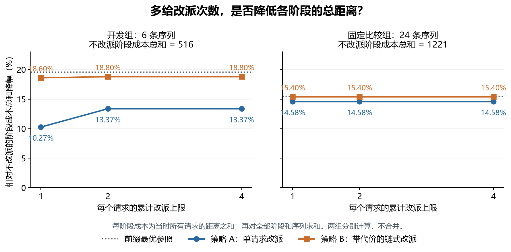

# 有限改派在线匹配：预算、腾位链与使用时机

本轮完成两种策略、30条固定序列、独立穷举核验及两个分步例子。
24条统一比较序列中，单次腾位降低阶段成本和14.58%，预算定价链降低15.40%；预算1、2、4的结果相同。
开发例证明第二次改派可能有用，也证明过早用尽一次预算可能比完全不改派更差。证据见第5节与第6节。

## 1. 摘要

**本组比较支持先改进改派对象和时机，再增加预算。** 单次腾位在预算1、2、4下的阶段成本和均为1043，预算定价链均为1033。不改派为1221，当前前缀精确最优合计为1033。定价链额外移动2个旧请求，少付10个阶段距离单位。证据：[正式汇总](../output/20260924T175731049376Z-eval/summary.json)，`aggregates` 中 `family=all`。

**这个结论只描述本轮固定输入。** 24条比较序列中，均匀与远近布局合计12条原本就已经最优。定价链节省的188个距离单位中，156个来自分离点对，占82.98%。预算1在比较集中足够，不等于一般输入只需改派一次。证据：同上，四个分族聚合；156/188为直接除法。

**本轮得到一个带条件的证明。** 若服务点分成两点小组，每组最多两个内部请求，组间最小间隙大于最大组宽的两倍，则单次腾位在每个到达阶段都最优。每个请求最多改派一次。证明见[数学说明](数学说明.md#已证明性质三充分分离的服务点对只需预算-1)。这是本轮整理的受限性质，不主张文献新颖性。

## 2. 问题

**预算按单个请求整个序列累计，而不是平均次数。** 在线匹配（Online Matching）要求新请求到达后立即分配到一个未被其他请求占用的服务点。服务点位置事先全部已知。改派（Recourse）是旧请求改变服务点，首次分配免费。预算 `b=1、2、4` 表示每个请求最多实际改派的次数。

**目标保留每个阶段的总距离。** 第 `t` 次到达后的成本记为 `C_t`，主汇总 `H=Σ_t C_t` 称为阶段成本和。它相当于每阶段持续一个时间单位时的累计距离成本。它不是最终阶段距离，也不是实际移动路程。本轮没有给不同阶段设置不同持续时间。

**精确参照只使用当前前缀。** 前缀（Prefix）是截至当前已经到来的请求。参照 `OPT_t` 是这些请求到全部服务点的最小匹配距离。它通过排序动态规划求值，再由全部单射穷举核对。单射表示不同请求使用不同服务点。参照只报成本，不伪装为满足改派预算的执行策略。协议与同分规则见 [protocol.md](../protocol.md)。

## 3. 文献与本轮切口

**三篇原始论文提供了增广路径、冻结和收益核算的依据。** Megow与Nölke的2025年论文最接近逐请求预算，但其常数次数保证有空间交替布局条件。Gupta、Krishnaswamy、Sandeep的2019/2020年论文给出直线上的均摊改派保证。Raghvendra的2018年论文提供增广路径净成本的分析方法。逐篇算法、页码、定理与原文链接见[文献阅读](文献阅读.md)。

**本轮只研究小预算下如何选择动作。** 第一策略只移动一个旧请求。开发观察后，第二策略允许连锁腾位，并对接近用尽预算的旧请求提高移动门槛。没有复现论文整套算法，因此也没有继承论文的竞争比保证。竞争比（Competitive Ratio）是对所有合法输入成立的最坏成本比，不能用这30条序列估计为理论保证。

**2026年直接相关新论文仍缺全文。** 已确认官方接受目录中的 *Near Optimal Online Bipartite Matching on the Line with Amortized Logarithmic Recourse*。本轮不把这个缺口解释为研究空白，也不作新颖性结论。[官方目录](https://www.fsttcs.org.in/2026/papers.php)

## 4. 数据与设计

**全轮只有6条开发序列和24条统一比较序列。** 每条都有6个服务点与6个请求。开发含分离点对、均匀陷阱、聚集、远近到达、预算耗尽和嵌套尺度六例。比较包含四种布局，每种六个顺序。坐标、请求编号、到达顺序与随机种子20260925都已保存。证据：[inputs.json](../inputs.json)、[输入指纹](../input_manifest.json)。

**比较是固定实例描述，不是独立泛化评测。** 四种布局与开发布局有关。`paired_01` 还与 `dev_pair` 完全相同。全部比较输入在查看比较结果前固定，后续没有挑选或替换。开发与比较重复使用同一布局的事实必须保留。原始文件的SHA-256为 `85e76d853f0dc7c6ef82e05ff180b3b1b0cffa24f625014c7e74d319fa42c3fd`。SHA-256是用于核对文件内容的摘要。

**两种策略都先完整规划，再执行选定动作。** 增广链（Augmenting Path）是一串以空闲服务点结束的腾位动作。执行时从链末端开始，先让旧请求移到空位，再逆向腾空其他服务点，最后给新请求首次分配。每次实际改变都计数。同一步不会让一个旧请求来回移动。

|策略|选择对象与时机|同分处理|
|---|---|---|
|最近空位 `nearest`|新请求使用最近空闲服务点，旧请求保持原分配|距离、服务点坐标、编号|
|单次腾位 `single`，下文称策略A|每次到达比较直接分配与所有移动一个旧请求的方案；只选当前成本最小者|成本、改派数、按到达顺序的服务点编号元组|
|预算定价链 `priced_chain`，下文称策略B|每次到达比较直接分配与所有合法简单增广链；最小化真实成本加预算价格|含价格成本、真实成本、改派数、编号元组|

**预算价格为服务点位移除以剩余次数的两倍。** 旧请求 `i` 已改派 `c_i` 次时，其移动价格为 `|s_new−s_old|/[2(b−c_i)]`。余量越少，使用一次机会的门槛越高。报告中的成本始终只含真实匹配距离，不加这项价格。系数1/2在比较前固定，没有参数搜索。使用有理数比较，避免浮点误差制造同分差异。实现见 [matching.py](../matching.py) 的 `choose`。

**只进行了一次策略改进。** 初版A在均匀开发例中漏掉长链收益，在预算耗尽例中又过早用完预算。于是形成B。开发后没有根据比较集再次调参。B同时改变了链长与选择时机，本轮主表不能把二者贡献单独归因。开发过程与旧结果见[过程记录](../过程/2026-09-25.md)。

## 5. 量化结果

**正式比较中，增加预算没有改变成本或改派次数。** 下表合计24条序列。阶段成本和与最终成本均使用输入坐标单位。耗时为24条序列、每条6阶段的策略墙钟时间之和，不含精确参照、验证、绘图与文件读写。证据：[summary.json](../output/20260924T175731049376Z-eval/summary.json)，`family=all`；逐序列见 [metrics.csv](../output/20260924T175731049376Z-eval/metrics.csv)。

|策略|预算|阶段成本和|最终成本合计|相对不改派降幅|总改派|单请求最大改派|墙钟毫秒|
|---|---:|---:|---:|---:|---:|---:|---:|
|最近空位|0|1221|372|0%|0|0|0.771|
|A|1|1043|310|14.58%|13|1|1.194|
|A|2|1043|310|14.58%|13|1|1.087|
|A|4|1043|310|14.58%|13|1|1.102|
|B|1|1033|306|15.40%|15|1|43.670|
|B|2|1033|306|15.40%|15|1|60.481|
|B|4|1033|306|15.40%|15|1|63.625|
|当前前缀精确参照|不适用|1033|306|15.40%|不适用|不适用|0.695|

**B每多改派一次，平均换得5个阶段距离单位。** 这里比较B与A：成本和再降10，改派总数从13增到15。B的枚举开销也更高。所有计时只测一次，不能据毫秒差异作细微速度排名。Windows的CPU计时粒度会让短调用显示0，详细CPU值仍保存于CSV。

**B在144个比较前缀中全部达到精确最优。** A达到139个，最大前缀成本比为1.667；最近空位的最大比为2.333。该计数按每种策略、每种预算分别计算。证据：[traces.json](../output/20260924T175731049376Z-eval/traces.json)，逐条比较 `history[].cost` 与 `oracle_costs`；最大比另见汇总。

**收益只出现在其中两类比较布局。** 下面预算取1，预算2与4数值相同。所有分族数字均来自正式汇总的对应 `family`。

|布局，每类6条|不改派阶段成本和|A|B|B降幅|
|---|---:|---:|---:|---:|
|均匀 `uniform`|378|378|378|0%|
|局部聚集 `clustered`|158|136|126|20.25%|
|远近布局 `near_far`|126|126|126|0%|
|分离点对 `paired`|559|403|403|27.91%|

**开发序列显示了比较集没有覆盖到的预算收益。** 六条开发序列的不改派成本和为516，精确参照为415。A的预算1/2/4成本和为463/447/447，总改派7/8/8。B分别为420/419/419，总改派10/13/13。A从1增加到2节省16个阶段距离单位，B只节省1个；从2增加到4都没有额外收益。证据：[开发汇总](../output/20260924T175730918352Z-dev/summary.json)，`family=all`。

**价格门槛也会拒绝值得做的当前调整。** `dev_nested` 中A的成本和为147，B为151，三个预算均如此。B保留了次数，却没有等到足以通过门槛的收益。这是B的实际损失，不在最终汇总中删除。证据：[开发指标](../output/20260924T175730918352Z-dev/metrics.csv)，`case_id=dev_nested`。

三张图由保存结果生成，见正式结果目录的 `figures/`。下图区分开发与比较的预算收益。另可打开[布局收益图](../output/20260924T175731049376Z-eval/figures/02_layout_benefit.png)和[阶段成本图](../output/20260924T175731049376Z-eval/figures/03_examples_by_stage.png)。

## 6. 两个机制例子

**长链例说明，增加单请求次数不能代替一次调整的范围。** 服务点为0、10、20、30、40、50，请求依次为4、14、24、34、44、1。前五步均就近分配。最后一步直接分配的总距离是69，A只移动一个旧请求后为61；B让五个旧请求各改派一次，总距离为31，达到精确最优。阶段成本和分别为129、121、91。证据：开发轨迹 `case_id=dev_uniform`。

**预算耗尽例说明，眼前最优可能损害后续。** 服务点前三个为0、3、5，请求前三个依次为2、3、0。A在第二步把请求2从服务点3移到0，把当前成本从3降到2。第三步若预算仅1，就不能再移动该请求，成本升到7；预算2允许它改到5，成本变成3。B在预算1时拒绝第二步那次小收益，前三步成本为1、3、3。完整六步的成本和为A1=37、A2=21、B1=22、不改派=22。后面三个远处请求只用于补足六点，详见[分步例子](分步例子.md)。证据：开发轨迹 `case_id=dev_budget`。

两个例子均来自已冻结的6条开发序列。没有为讲解另加实验序列。

## 7. 数学解释与证据层级

**已经证明的结论包含受限最优性与精确门槛。** A在第二个请求到达后总能达到前缀最优。充分分离的两点小组中，A在所有阶段最优，每个请求至多改派一次。分离点对比较族满足组宽10、组间隙90，因此90>2×10；其六个顺序都与命题一致。输入证据为 `inputs.json` 中 `family=paired`，证明见[数学说明](数学说明.md)。

**局部收益可以精确解释。** 两条逆序边交换为顺序匹配时，收益等于请求区间与服务点区间重叠长度的两倍。若只有两个服务点 `u<v`，首请求 `x` 先配左端点，次请求 `y<x` 到达，二者都在区间内，则B首次交换的门槛为 `x−y≥(v−u)/(4b)`。这是价格公式的代数结论，不是未知未来下的最优门槛。

**观察到的饱和不构成一般定理。** 本轮30条序列都没有出现预算4比预算2进一步降低阶段成本的情形。预算1比2更差的明确例子只在开发中出现。当前输入不足以量化需要第三、第四次改派的频率。没有证明任意输入上的预算单调收益，也没有证明B的竞争比。

**最值得继续的是一个受限门槛问题。** 在只有三个服务点、最多三个请求的线上模型中，固定已到达前缀，剩余请求位置限定在服务区间内。对预算1，能否推导“第二次到达时是否动用首请求预算”的最坏后续损失最小门槛？本轮的 `dev_budget` 已证明当前收益最大的动作可能选错时机。下一轮应先做分段解析，而不是扩大随机数据。这个问题是待研究方向，尚未得到门槛定理。

## 8. 核验、开销与交付

**独立验证通过，但用户本人审阅尚未进行。** 验证器不导入策略实现。它直接从坐标枚举58,680个前缀单射，另核对1,260个在线阶段的实际执行、累计改派、价格择优与同分规则。240行逐序列指标及96组汇总均一致。两次内存篡改成本各加1都被拒绝。证据：[开发核验](../output/20260924T175730918352Z-dev/verification.json)与[比较核验](../output/20260924T175731049376Z-eval/verification.json)。

**本轮单进程运行，没有安装依赖或使用显卡。** 正式计算进程记录0.1875 CPU秒，开发与比较独立核验合计0.515625 CPU秒。这些是对应原始运行记录，不含文献阅读、绘图与入口复跑。全轮开销记录见过程末尾。小规模完整链枚举只适用于本轮上限，没有验证大输入的可扩展性。

**复现入口是 [run.ps1](../run.ps1)。** 它串联输入检查、手算检查、开发与比较计算、独立核验、绘图和结果封装。每次写入新目录。策略、固定输入、协议、结果表、轨迹、三图、声明索引与文件指纹都随实验目录保存。文件说明和运行方法见[README](../README.md)。

正式结果已经在私人仓库中通过默认入口复现，分配、成本及改派记录逐项相同。保存的计算、核验与绘图CPU记录合计3.578125秒；启动、单测和论文处理未纳入该数。53个文件指纹与36个文档链接的读回结果见 [交付核对](../过程/交付核对.json)。该记录不代表用户本人已审阅。
